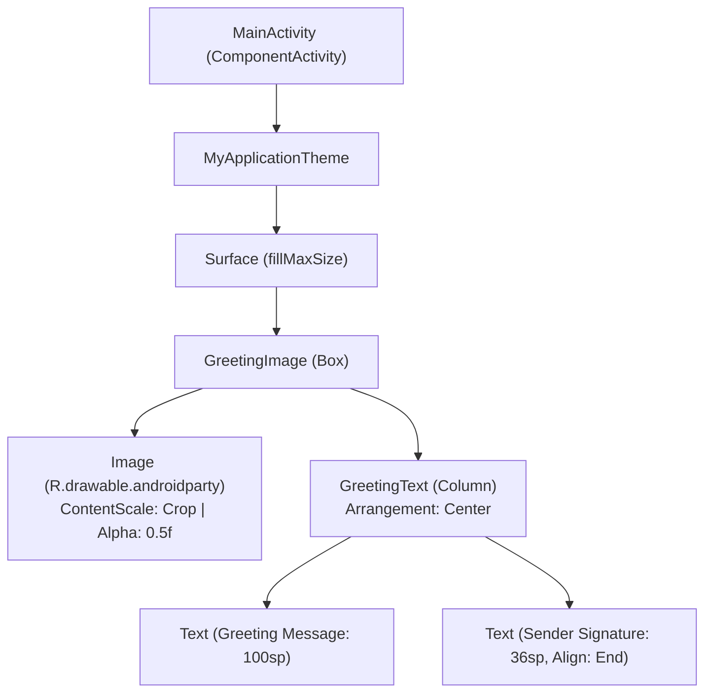

# 🎂 Birthday Card Android App

[](https://kotlinlang.org)
[](https://developer.android.com)
[](https://developer.android.com/jetpack/compose)
[](https://m3.material.io)
[](https://developer.android.com/tools/releases/platforms)
[](https://developer.android.com/tools/releases/platforms)

A modern, declarative Android application built with **Jetpack Compose** and **Material Design 3**, created as part of the official [Google Android Basics with Compose](https://developer.android.com/courses/android-basics-compose/course) course.

This project demonstrates foundational Android development skills, including declarative UI construction, multi-layer composable layouts, resource management, edge-to-edge rendering, and dynamic theming.

---

## 📱 Features

- **Declarative UI with Jetpack Compose**: 100% Kotlin-based UI architecture, doing away with traditional XML layouts.
- **Layered Visual Composition**: Uses `Box` layout to superimpose congratulatory typography onto a cropped background graphic with subtle opacity (`alpha = 0.5f`).
- **Responsive Typography & Formatting**:
  - Dynamically sized headline (100 sp) with fine-tuned line-height (116 sp) to prevent clipping.
  - End-aligned personal signature (36 sp) with structured padding.
- **Modern Edge-to-Edge Experience**: Adheres to modern Android display standards via `enableEdgeToEdge()`.
- **Material 3 & Dynamic Theming**: Supports dynamic color adaptation on Android 12+ (API 31+) as well as custom Light and Dark color schemes.
- **Instant Android Studio Previews**: Includes `@Preview` annotations (`BirthdayCardPreview`) for rapid UI iteration without rebuilding to an emulator or physical device.

---

## 🏗️ UI Layout Hierarchy

The UI structure demonstrates how composable containers nest and arrange elements:



---

## 🛠️ Tech Stack & Architecture

| Component | Technology / Specification |
|---|---|
| **Language** | [Kotlin](https://kotlinlang.org/) `v2.2.10` |
| **UI Toolkit** | [Jetpack Compose](https://developer.android.com/jetpack/compose) (BOM `2026.02.01`) |
| **Design System** | [Material 3](https://developer.android.com/jetpack/compose/material3) |
| **Activity Integration** | AndroidX `activity-compose` `v1.8.0` |
| **Build System** | Gradle Kotlin DSL (`build.gradle.kts`) with Gradle Version Catalogs (`libs.versions.toml`) |
| **Android Gradle Plugin** | AGP `v9.4.0` |
| **Minimum SDK** | API 24 (Android 7.0 Nougat) |
| **Target / Compile SDK** | API 37 |
| **Java Compatibility** | Java 11 |

---

## 📂 Project Structure

```plaintext
Birthday-Card-Android-Google-Course/
├── app/
│   ├── build.gradle.kts              # Module-level Gradle configuration
│   └── src/
│       ├── main/
│       │   ├── AndroidManifest.xml   # App manifest & launcher configuration
│       │   ├── java/com/example/myapplication/
│       │   │   ├── MainActivity.kt   # Core entry point & Composable functions
│       │   │   └── ui/theme/         # Material 3 design system tokens
│       │   │       ├── Color.kt      # Color palette definitions
│       │   │       ├── Theme.kt      # MyApplicationTheme (Dynamic, Light & Dark)
│       │   │       └── Type.kt       # Material 3 typography definitions
│       │   └── res/
│       │       ├── drawable/         # Image resources (androidparty.png)
│       │       └── values/           # Strings, colors, and XML themes
│       └── test/                     # Unit and Instrumented tests
├── gradle/
│   └── libs.versions.toml            # Centralized dependency version catalog
├── build.gradle.kts                  # Root Gradle build script
└── settings.gradle.kts               # Plugin & repository settings
```

---

## 🚀 Getting Started

### Prerequisites

Ensure you have the following installed:
- [Android Studio](https://developer.android.com/studio) (Ladybug / Meerkat or later recommended)
- **JDK 11** or higher
- Android SDK Platform for API 37

### Installation & Run

1. **Clone the repository**:
   ```bash
   git clone https://github.com/elabenkhedher/Birthday-Card-Android-Google-Course.git
   cd Birthday-Card-Android-Google-Course
   ```

2. **Open in Android Studio**:
   - Launch Android Studio.
   - Select **Open** and select the cloned project folder.
   - Wait for Gradle to download dependencies and sync.

3. **Run on Emulator or Physical Device**:
   - Select your target device or create an AVD (Android Virtual Device).
   - Click the green **Run (▶)** button, or execute from your terminal:
     ```bash
     ./gradlew installDebug
     ```

4. **Run Android Studio Preview**:
   - Open `app/src/main/java/com/example/myapplication/MainActivity.kt`.
   - Toggle the **Split** or **Design** view in the top-right corner to see `BirthdayCardPreview` live.

---

## 🎨 Customizing the Card

You can easily adapt this birthday card for someone special:

1. **Change the Recipient & Sender**:
   In [`MainActivity.kt`](app/src/main/java/com/example/myapplication/MainActivity.kt):
   ```kotlin
   GreetingImage(
       msg = "Happy Birthday [Recipient]!",
       from = "From [Your Name]"
   )
   ```

2. **Use a Different Background Image**:
   - Place your custom `.png` or `.jpg` image in `app/src/main/res/drawable/`.
   - Update the resource reference inside `GreetingImage`:
     ```kotlin
     val image = painterResource(R.drawable.your_image_name)
     ```

3. **Adjust Background Opacity**:
   Modify the `alpha` value of the `Image` composable (ranging from `0.0f` to `1.0f`):
   ```kotlin
   Image(
       painter = image,
       contentDescription = null,
       contentScale = ContentScale.Crop,
       alpha = 0.6F // adjust transparency to enhance readability
   )
   ```

---

## 👤 Author

**Ela Ben Khedher**
- **GitHub:** [@elabenkhedher](https://github.com/elabenkhedher)
- **Instagram:** [@ela_ben_khedher](https://www.instagram.com/ela_ben_khedher/)
- **LinkedIn:** [Ela Ben Khedher](https://www.linkedin.com/in/ela-ben-khedher-949a26239/)
- **Email:** [elabenkedher@gmail.com](mailto:elabenkedher@gmail.com)

---

## 📚 Acknowledgments & References

- Developed following the [Google Android Basics with Compose](https://developer.android.com/courses/android-basics-compose/course) curriculum.
- Background celebration artwork and design patterns provided by Google Developers Training.
- Built with ❤️ using [Kotlin](https://kotlinlang.org/) and [Jetpack Compose](https://developer.android.com/jetpack/compose).

---

## 📄 License

This project is open-source and intended for educational and reference purposes. Feel free to use and adapt it for your own learning journey!
